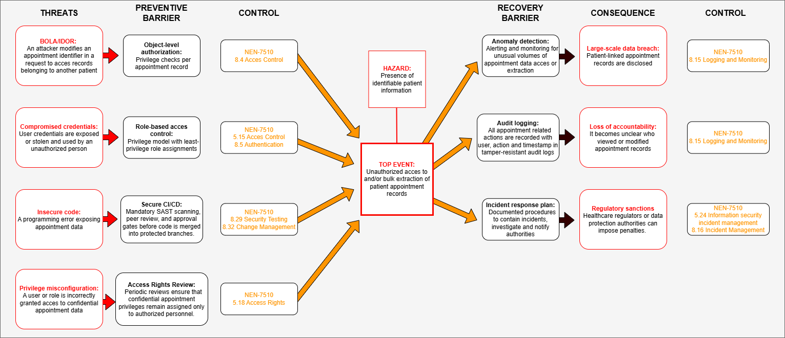

# Bow-Tie Analysis – Unauthorized Access to Appointment Records

## Purpose

This Bow-Tie analysis was created based on the CIA analysis of the OpenMRS Appointment Scheduling Module. The objective is to identify the main threats that could lead to unauthorized access to patient appointment records and to document the preventive and recovery controls that reduce the likelihood and impact of such an event.

## Source Risk

| Asset | Risk Score | Treatment |
|---------|---------|---------|
| Appointment records | 20 | Mitigate before release |

## Hazard

Presence of identifiable patient information within the Appointment Scheduling Module.

## Top Event

Unauthorized access to and/or bulk extraction of patient appointment records.

## Bow-Tie Diagram

## Threats and Preventive Controls

| Threat | Preventive Barrier | NEN 7510:2024-2 |
|----------|----------|----------|
| BOLA / IDOR | Object-level authorization | 8.4 |
| Compromised credentials | Role-based access control | 5.15, 8.5 |
| Insecure code | Secure CI/CD | 8.29, 8.32 |
| Privilege misconfiguration | Access rights review | 5.18 |

## Consequences and Recovery Controls

| Consequence | Recovery Barrier | NEN 7510:2024-2 |
|----------|----------|----------|
| Large-scale data breach | Anomaly detection | 8.15 |
| Loss of accountability | Audit logging | 8.15 |
| Regulatory sanctions | Incident response plan | 5.24, 8.16 |

## Rationale

The selected threats were derived from the CIA analysis and represent realistic attack paths that could result in unauthorized disclosure of patient-related appointment information. The controls were mapped to NEN 7510:2024-2 to demonstrate how the identified risks can be mitigated through technical, procedural, and organizational measures.

## References

- CIA Analysis (`cia-analysis.md`)
- CIA Review Meeting Notes (`cia-review-meeting-notes.md`)
- NEN 7510:2024-2