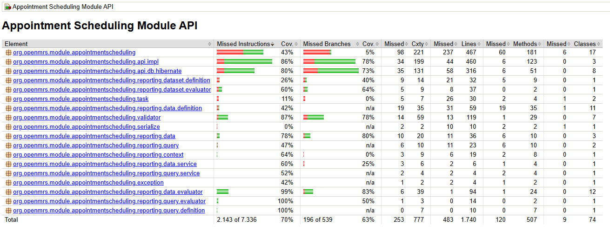

# Code Coverage

## Objective

The objective of this task was to configure and activate code coverage measurement for the Appointment Scheduling Module and integrate coverage reporting into the CI/CD pipeline.

## Baseline Situation

At the start of the project, no code coverage tooling was configured.

As a result:

* Test coverage could not be measured.
* No coverage reports were generated.
* No coverage artifacts were available through the CI pipeline.
* Coverage metrics could not be used to evaluate software quality.

The baseline coverage report generated after configuring JaCoCo is shown below.



## Implemented Improvement

JaCoCo was configured through the Maven build process using the `jacoco-maven-plugin`.

The plugin generates coverage reports during test execution and produces:

* HTML coverage reports
* XML coverage reports
* Coverage execution data

A dedicated GitHub Actions workflow was added to the CI/CD pipeline. The workflow automatically:

1. Executes the automated test suite.
2. Generates JaCoCo coverage reports.
3. Uploads the reports as GitHub Actions artifacts.

This ensures that coverage information is available for every relevant build and can be reviewed independently of a local development environment.

## Coverage Results

Coverage was measured using the following command:

```bash
mvn -pl api clean test
```

Results:

| Metric       | Coverage |
| ------------ | -------- |
| Instructions | 70%      |
| Branches     | 63%      |
| Lines        | 72%      |
| Methods      | 76%      |
| Classes      | 88%      |

## Coverage Target

A minimum line coverage target of 70% was selected.

### Rationale

The Appointment Scheduling Module is a legacy OpenMRS component containing a significant amount of existing functionality and technical debt. A 70% threshold provides a realistic balance between development effort and software quality while ensuring that most business logic is exercised by automated tests.

The measured line coverage of 72% exceeds the defined quality target.

## Coverage Interpretation and Risk-Based Testing

The measured line coverage of 72% demonstrates that a substantial portion of the codebase is executed during automated testing. However, code coverage alone is not considered sufficient evidence of software quality or security.

Coverage metrics indicate which code is executed by tests, but they do not demonstrate whether critical functionality, security controls, or high-risk scenarios have been adequately validated.

For this reason, coverage results were evaluated together with the CIA analysis performed for the Appointment Scheduling Module.

### Coverage and CIA Alignment

The CIA analysis identified several high-priority risks requiring mitigation before release, including:

* Unauthorized access to appointment records.
* Exposure of confidential appointment types.
* Incorrect scheduling information affecting appointment integrity.
* Missing or altered audit information.
* Insufficient privilege enforcement in the UI and API.

The existing automated test suite covers a significant portion of the appointment scheduling functionality, contributing to the measured 72% line coverage. In addition, the project team reviewed whether the implemented tests exercise the areas associated with the highest CIA risks.

Coverage is therefore used as a supporting quality metric rather than as a standalone objective.

### Coverage Traceability Matrix

Aggregate coverage (72% lines) says nothing about whether the highest-risk assets are tested. The table below cross-references every asset from the CIA risk register (`cia-analysis.md` §5/§7) against the **branch coverage** of the class(es) that implement it, measured by JaCoCo (`mvn -pl api clean test`, `api/target/site/jacoco/jacoco.xml`). Branch coverage is used here instead of line coverage because it better reflects whether both outcomes of a decision (e.g. "is this appointment confidential?", "does this overlap?") were actually exercised by a test, not just whether the line ran.

### Verdict Definitions

- **Adequate** — a test exists that explicitly creates the risky scenario and asserts it is rejected or handled correctly. The negative case is proven, not assumed.
- **Partial** — the "happy path" is tested, but either the negative/denied case is missing, or the control works correctly in one place but is not applied consistently everywhere it is needed.
- **Gap** — no test proves the risk is mitigated. Either the production code for that control does not exist yet, or the existing test actually demonstrates that the vulnerability is still present.

**Methodology:** the verdict was never read off the coverage percentage alone. For each asset, the test source code was read directly — what it actually constructs and asserts — and cross-checked against the relevant production code and the project's existing security documentation (`pentest-report.md`, `security-requirements-mapping.md`). Coverage percentages are supporting evidence for *how much* of a class was exercised; they do not say *whether* the exercised behaviour is the safe behaviour. This is why a class can show 90% coverage and still get a "Gap" verdict (see Appointment Records below).

| CIA Asset | Risk Score | Branch Coverage | Tests Reviewed | Verdict |
| --- | --- | --- | --- | --- |
| Appointment records | 20 | 78.1% | `AppointmentServiceTest`, `ConfidentialAppointmentAccessControlTest` | Gap |
| Confidential appointment types | 15 | 86–96% | `AppointmentTypeServiceTest`, `PatientToAppointmentDataEvaluatorTest`, `PersonToAppointmentDataEvaluatorTest` | Partial |
| Appointment requests and notes | 15 | 50% | `AppointmentRequestServiceTest` | Gap |
| Appointment blocks and time slots | 15 | 50–86% | `AppointmentBlockValidatorComponentTest`, `TimeSlotServiceTest` | Adequate |
| Provider schedules | 8 | 50–72% | `ProviderScheduleServiceTest` | Adequate |
| Appointment status history | 8 | 50% | `AppointmentStatusHistoryServiceTest` | Partial |
| Audit metadata | 8 | N/A | None dedicated | Gap |
| UI and privilege configuration | 8 | 78.1% | `AppointmentServiceTest` | Partial |

Per asset:

#### Appointment Records

**Relevant Metrics**

```
AppointmentServiceImpl
- Line Coverage: 90.4%
- Branch Coverage: 78.1%
- Methods Covered: 95%
```

**Explanation**

Although `AppointmentServiceImpl` achieves high line and branch coverage, a known confidentiality vulnerability remains present. The existing `ConfidentialAppointmentAccessControlTest` demonstrates the information disclosure vulnerability rather than verifying that access is denied. Therefore the dominant CIA risk remains unmitigated despite high coverage.

#### Confidential Appointment Types

**Relevant Metrics**

```
AppointmentTypeValidator
- Line Coverage: 94.6%
- Branch Coverage: 96.2%
- Methods Covered: 90.9%

PatientToAppointmentDataEvaluator / PersonToAppointmentDataEvaluator
- Line Coverage: 100%
- Branch Coverage: 85.7%
- Methods Covered: 100%
```

**Explanation**

The two reporting evaluators that actually enforce the confidentiality privilege are well tested, and a passing test (`evaluate_shouldReturnPatientDataForNonConfidentialAppointments`) proves confidential appointments are correctly filtered out of report exports. The same privilege check is never applied in `AppointmentServiceImpl` (see above), so the same appointment is hidden in reports but fully exposed through the core service and REST API — high coverage on both ends hides an inconsistency between them.

#### Appointment Requests and Notes

**Relevant Metrics**

```
AppointmentRequestValidator
- Line Coverage: 90.9%
- Branch Coverage: 50%
- Methods Covered: 100%
```

**Explanation**

The missed branch is a defensive `if (obj == null)` check that tests never trigger — not a security control. The real gap is elsewhere: no test, and no production code, masks the free-text `reason` / `cancel_reason` fields or keeps them out of logs for users without the right privilege. That protection has not been implemented yet, so there is nothing to test.

#### Appointment Blocks and Time Slots

**Relevant Metrics**

```
AppointmentBlockValidator
- Line Coverage: 90.9%
- Branch Coverage: 85.7%
- Methods Covered: 100%

TimeSlotValidator
- Line Coverage: 90%
- Branch Coverage: 50%
- Methods Covered: 100%
```

**Explanation**

The core integrity rule — rejecting overlapping/double-booked appointment blocks — is explicitly created and asserted in `shouldNotAllowCreationOfOverlappingAppointmentBlock`. `TimeSlotValidator`'s lower branch score is the same untested null-check pattern seen above, not a missed integrity rule. The one real gap is concurrency: no test verifies that parallel writes can't corrupt schedule state.

#### Provider Schedules

**Relevant Metrics**

```
ProviderScheduleValidator
- Line Coverage: 86.7%
- Branch Coverage: 50%
- Methods Covered: 100%

HibernateProviderScheduleDAO
- Line Coverage: 84.6%
- Branch Coverage: 72.2%
- Methods Covered: 100%
```

**Explanation**

CRUD and validation are exercised by `ProviderScheduleServiceTest`. The validator's partial branch score is again the unexercised null-check branch, not a missing business rule.

#### Appointment Status History

**Relevant Metrics**

```
AppointmentStatusHistoryValidator
- Line Coverage: 85.7%
- Branch Coverage: 50%
- Methods Covered: 100%
```

**Explanation**

Save, retrieval, and status-change transitions are tested. No test verifies that a historical record cannot be altered after creation — that tamper-resistance guarantee is unverified.

#### Audit Metadata (creator, changed-by, void reasons)

**Relevant Metrics**

```
No dedicated class — fields are inherited from the OpenMRS
Auditable / Voidable base classes.
```

**Explanation**

No module-specific test checks that creator, changed-by, or void-reason fields resist modification through a normal (non-admin) module operation. This relies entirely on unverified platform behaviour.

#### UI and Privilege Configuration

**Relevant Metrics**

```
AppointmentServiceImpl (41 @Authorized checks)
- Line Coverage: 90.4%
- Branch Coverage: 78.1%
- Methods Covered: 95%
```

**Explanation**

Every privilege-gated method is exercised under an authorized user, but no test exercises the *denied* path for any of the 41 `@Authorized` checks — except the confidentiality privilege, where the existing test proves the opposite of what's intended (see "Appointment Records" above).

**Reading the matrix:** of the four risks scored ≥15, only schedule integrity (appointment blocks/time slots) is adequately tested. All three confidentiality risks trace back to the same root cause — `PRIVILEGE_VIEW_CONFIDENTIAL_APPOINTMENT_DETAILS` is enforced in the reporting evaluators but not in the core service, REST, or web layers — and this is an open, reproducible finding (`pentest-report.md` F-01, issue #36), not a blind spot in this analysis.

**This matrix is the baseline for the project, not a one-off report.** It should be re-run and re-read whenever a relevant security requirement (SR-01 through SR-08) is implemented, so a verdict only moves from "Gap" or "Partial" to "Adequate" once a test exists that actually proves the negative case — not because the surrounding code's line/branch percentage went up. Concretely: every time a Gap/Partial item is closed in the backlog, this section should be regenerated against the new JaCoCo report and the affected explanation updated, so the document keeps reflecting what is actually proven rather than what was once true.

### Limitations of Coverage Metrics

A high coverage percentage does not guarantee that critical functionality is tested correctly.

For example, it is possible to achieve a relatively high coverage percentage while still missing tests for security-critical functionality such as authorization checks, confidential appointment handling, or audit logging behaviour.

Therefore, coverage results should always be interpreted together with:

* Risk assessments.
* Security analyses.
* Functional test results.
* Code reviews.

The goal is not to maximize coverage at all costs, but to ensure that testing efforts focus on the most important business and security risks.

## Evidence

Coverage reports are generated in:

```text
api/target/site/jacoco
```

The CI pipeline publishes these reports as downloadable GitHub Actions artifacts, allowing reviewers to inspect coverage results without requiring a local build environment.

## Conclusion

Code coverage measurement has been successfully configured and integrated into the CI/CD process.

The project currently achieves 72% line coverage, exceeding the defined minimum target of 70%.

More importantly, testing efforts are evaluated in relation to the highest risks identified in the CIA analysis through the Coverage Traceability Matrix above. That review shows that high line coverage does not by itself mean the highest risks are covered: three of the four "Unacceptable" risks (all confidentiality-related) are only partially tested or have a known, unmitigated gap (F-01, issue #36), while the fourth (schedule integrity) is adequately tested. This is a more useful signal than the aggregate 72% figure and should drive the next testing priorities: closing the confidentiality enforcement gap on the core/REST paths and adding denied-access and audit-immutability tests.
