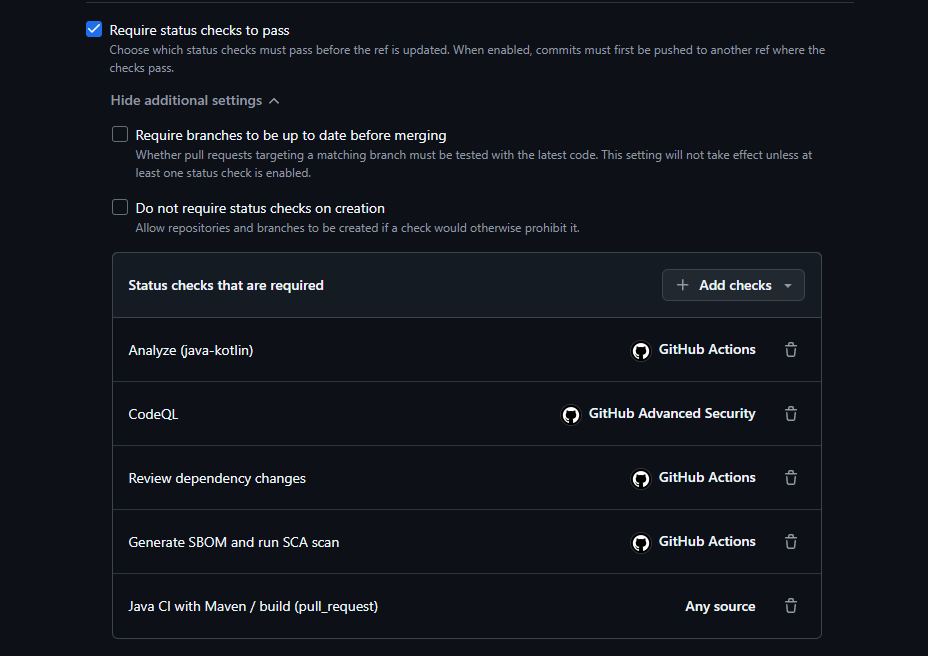

# SR-08 - Strengthen CI/CD Security Gates and Branch Protection (#76)

Sprint-3 mitigation record. Documents the changes made for issue #76, the gate demonstration, and any
code changes (per the sprint-3 rule that all code changes are documented).

## Summary

The pipeline already ran CodeQL (SAST), Dependency Review and SBOM/SCA, but most checks were **not
enforced** as required status checks, so a PR could merge with them red. This mitigation makes the
security checks blocking and documents the gate set. Reference policy: `../ci-cd-security-gates.md`.

## Changes made

| Change | Type | Merged to product? |
|--------|------|--------------------|
| Required status checks added on `main`/`dev`: CodeQL (Analyze java-kotlin + CodeQL/GitHub Advanced Security), Review dependency changes, Generate SBOM and run SCA scan, and Java CI with Maven / build | Branch-ruleset setting | n/a (repo setting) |
| Branch ruleset on `dev` + `main`: require PR before merging, require status checks, block force pushes, restrict deletions | Branch-ruleset setting | n/a (repo setting) |
| `documentation/ci-cd-security-gates.md` - gate reference + exception process | New doc | Yes |
| This mitigation record | New doc | Yes |

**No product/source code was changed by this issue.** The only repository change is documentation; the
gate enforcement is a branch-ruleset setting.

## Demonstration - gate blocks a high-risk vulnerability

A throwaway branch added a known-vulnerable dependency (`org.apache.logging.log4j:log4j-core:2.14.1` -
Log4Shell, CVE-2021-44228) to the module `pom.xml` and opened a PR into `dev`.

**Result:** the **Dependency Review** gate failed and blocked the PR, flagging two critical and one high
Log4j vulnerability, with the check marked **Required**:

The throwaway branch/PR was **closed without merging** - the vulnerable dependency never entered the
product. This satisfies the acceptance criterion *"test case demonstrates a security gate blocking a PR
with a high-risk vulnerability."*

### Secret scanning + push protection

Secret Protection and Push Protection are **enabled** in the repository settings (see screenshot below).

We attempted to demonstrate a live push-protection block on a throwaway branch using three test secrets:
two fabricated values (an AWS access-key pair and a Google API key) and one **real, zero-scope,
immediately-revoked** GitHub fine-grained PAT. **None of the three pushes were blocked** - all were
accepted by the remote.

So the control is **enabled per settings**, but a live block could **not be reproduced** in our tests.
This is recorded honestly as a **follow-up to investigate** - push-protection detection did not trigger on
our test pushes (possible causes: detection confidence, fine-grained-token handling, or a configuration
nuance). The real test PAT was zero-scope and revoked immediately, and the throwaway branch was deleted.

> Note: GitHub's secret-scanning **alerts** detect committed secrets independently of push protection, so
> detection/alerting may still function even though the push-time block did not trigger here.

### CodeQL SAST (static analysis)

CodeQL runs on every push and pull request to `main`/`dev` (`codeql.yml`) and on a weekly schedule. The
code-scanning **check-failure threshold is "High or higher"** (visible in the settings screenshot above),
and the **"Code scanning results / CodeQL"** check is a **required** status check - so a new high/critical
CodeQL finding fails the check and blocks the merge.

No staged demonstration (deliberately introduced vulnerability) was used: it adds nothing to the rubric,
which rewards the gate being *configured and enforced* here, and *real findings* under the security code
review. CodeQL's actual findings on the codebase are reviewed there rather than via a synthetic test.

## Final branch ruleset (enforced state)

The branch ruleset targets **`dev` and `main`** (2 targets) and enforces:

- **Require a pull request before merging** - no direct pushes to protected branches
- **Require status checks to pass** - the five checks below must be green before merge
- **Block force pushes** - history cannot be rewritten on protected branches
- **Restrict deletions** - protected branches cannot be deleted without bypass permission

The required status checks now include **Java CI with Maven / build**, completing the gate set:

| Required check | Provider |
|----------------|----------|
| Analyze (java-kotlin) | GitHub Actions |
| CodeQL | GitHub Advanced Security |
| Review dependency changes | GitHub Actions |
| Generate SBOM and run SCA scan | GitHub Actions |
| Java CI with Maven / build (pull_request) | Any source |

> **Note on "Any source":** the Java CI build check binds as *Any source* rather than to the specific
> "GitHub Actions" source like the other checks. This does **not** weaken enforcement - the check is still
> required and still blocks the merge when red; "Any source" simply means GitHub accepts a status of that
> name from any reporting source rather than pinning it to one workflow. It is recorded as a minor,
> accepted precision nuance rather than a functional gap.

## NEN-7510:2024-2 mapping

- **8.29** (security testing) - failing checks are enforced in the pipeline
- **8.8** (technical vulnerabilities) - Dependency Review blocks new vulnerable dependencies
- **8.32** (change management) - required checks + review make every merge controlled and traceable
- **8.25** (secure development lifecycle) - security activities integrated into the build process

## Notes / follow-ups

- The SBOM/SCA gate is intentionally non-blocking on findings (accepted platform-`provided` baseline, see
  `risk-assessment-report.md` §4.3); new vulnerable dependencies are blocked by Dependency Review.
- Minor: the `deny-licenses` option in `dependency-review.yml` is deprecated (noted in the demo output) -
  candidate for a small future cleanup.
- **Push protection follow-up:** enabled in settings but a live block was not reproducible (fabricated
  secrets and a real zero-scope PAT all pushed through, see Demonstration). Investigate why detection did
  not trigger on the test pushes.
- **"Any source" binding:** the Java CI build check is required but bound as *Any source* rather than the
  "GitHub Actions" source. Enforcement is unaffected (see note in Final branch ruleset); optionally re-pin
  it to the specific source once the workflow has reported a status in the exact branch/context GitHub
  needs to disambiguate.
